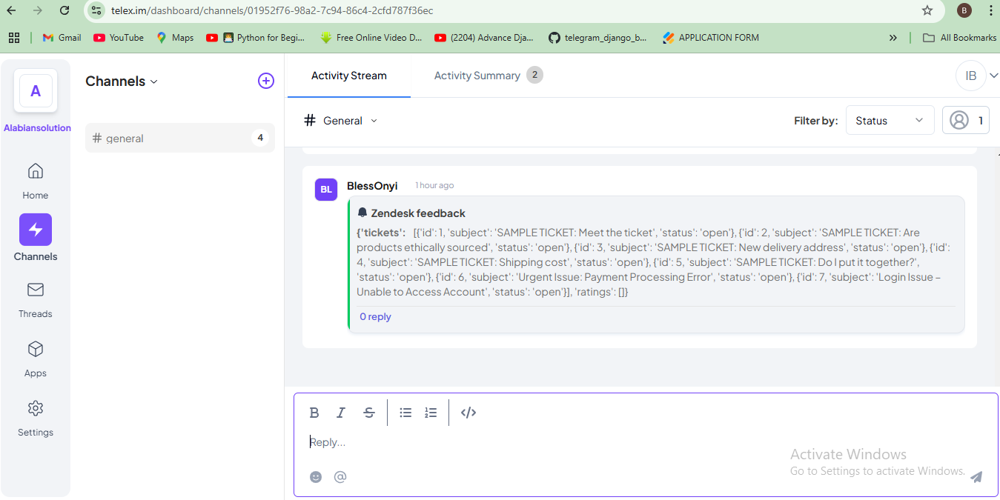

# HNG12 Stage 3 - Telex Integration

## Description

This is a RESTful API developed as part of the HNG12 internship Stage 3 task. The API integrates with Telex and Zendesk, allowing seamless data exchange between the two platforms. It retrieves and processes feedback data from Zendesk and formats it for use in the Telex system. The API is built using FastAPI for optimal performance, featuring robust error handling, authentication mechanisms, and dynamic response formatting.

Key Features:

- Fetch and process Zendesk feedback data
- Token-based authentication for secure access
- Dynamic date handling for created and updated timestamps
- CORS support for cross-origin requests
- Fast response time (< 500ms)
- JSON response format with proper error handling

## Technologies Used

- Python
- FastAPI
- Uvicorn
- CORS Middleware

## API Specification

### Endpoint
POST /api/v1/integration.json

### Request Format

The API expects a JSON request containing authentication and necessary parameters:
```json
{
  "auth_token": "your-auth-token",
  "zendesk_ticket_id": "12345"
}
```


### Response Format

The API returns a JSON response with HTTP status code 200 OK:
```json
{
  "data": {
    "date": {
      "created_at": "2025-02-20",
      "updated_at": "2025-02-20"
    },
    "feedback": {
      "ticket": "created ticket",
      "satisfaction_score": "Good",
      "average_response_time": "3 hours"
    }
  }
}
```

### Response Codes

- `200 OK` – Request successful

- `400 Bad Request` – Invalid request parameters

- `401 Unauthorized` – Invalid authentication token

- `500 Internal Server Error` – Server issue


## Local Development Setup

### Prerequisites

Ensure you have the following installed:

- Python 3.x

- pip

### Steps to Set Up Locally

1. **Clone the repository:**
    ```sh
    git clone https://github.com/BlessOnyi/hng12-stage3-telex.git
    cd hng12-stage3-telex

2. **Create and Activate a Virtual Environment:
    python -m venv venv

**Activate Environment**

- source venv/bin/activate  # On macOS/Linux

- venv\Scripts\activate  # On Windows

3 **Install dependencies**
    Run the following command to install all required dependencies:
    ```sh
    pip install -r requirements.txt

4 **Run the development server:**

-uvicorn main:app --reload

-The API will be available at: https://tfklhl45-8000.uks1.devtunnels.ms/integration.json
https://telex-zendesk-integration-one.vercel.app/integration.json


## Pictorial representation of telex getting tickets from zendesk


## Deployment

### To deploy this API using Vercel:
1. **Install Vercel CLI:**  
   ```sh
   npm i -g vercel

2. **Login to Vercel:**  
   ```sh
   vercel login


3. **Deploy to Production:**
   ```sh
   vercel --prod


## Installation
4. **Install dependencies**  
   Ensure you have requirements.txt. If you dont, Run the following command:
   ```sh
   pip install -r requirements.txt

5. **Set the start command**
  uvicorn main:app --host 0.0.0.0 --port $PORT

### Environment Variables  
- `PORT`: Server port (default: 8000)

AUTH_TOKEN: API authentication token from Zendesk

### The API is deployed at:

https://telex-zendesk-integration-one.vercel.app/integration.json
or 
https://tfklhl45-8000.uks1.devtunnels.ms/integration.json

### Testing
1. **Using Postman:**

- Open Postman
- Create a new GET request
- Enter the URL: Deployed API URL
- Send the request
- Verify the JSON response matches the specified format

2. **Performance:**
- Response time: < 500ms
- Monitored using Vercel Analytics
- Optimized for quick response through FastAPI's async capabilities


### Backlink related to my chosen programming language/stack:
[Hire Python Developers](https://hng.tech/hire/python-developers)


